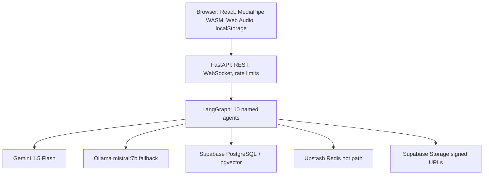

# Architecture Diagram Source

```mermaid
flowchart TD
  Browser["Browser: React, MediaPipe WASM, Web Audio, localStorage"]
  API["FastAPI: REST, WebSocket, rate limits"]
  Graph["LangGraph: 10 named agents"]
  Gemini["Gemini 1.5 Flash"]
  Ollama["Ollama mistral:7b fallback"]
  DB["Supabase PostgreSQL + pgvector"]
  Redis["Upstash Redis hot path"]
  Storage["Supabase Storage signed URLs"]

  Browser --> API
  API --> Graph
  Graph --> Gemini
  Graph --> Ollama
  Graph --> DB
  Graph --> Redis
  Graph --> Storage
```
